# Education Pathway - Hamza Ilyas

## Academic Journey Visualization

This document visualizes Hamza Ilyas's educational pathway from high school through his Master's degree, highlighting key milestones, institutions, and achievements.

---

## Complete Education Timeline

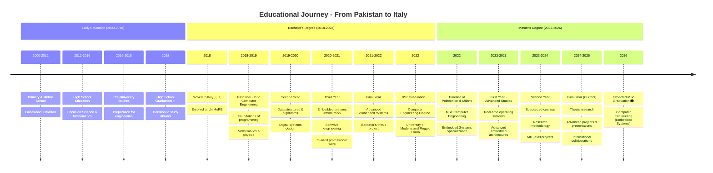

---

## Education Pathway Flow

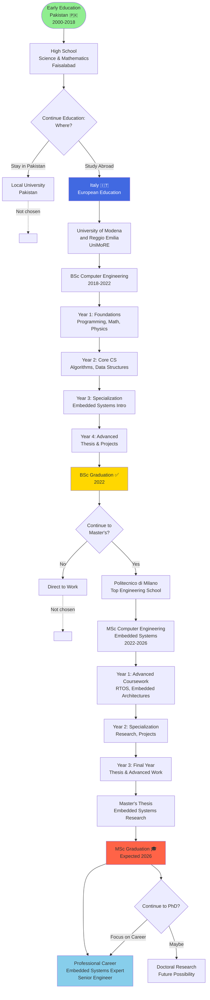

---

## Institution Comparison

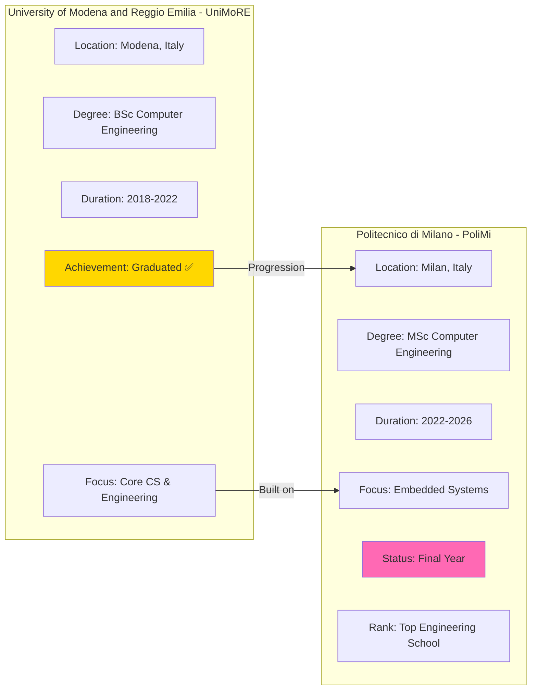

---

## Skills Development Timeline

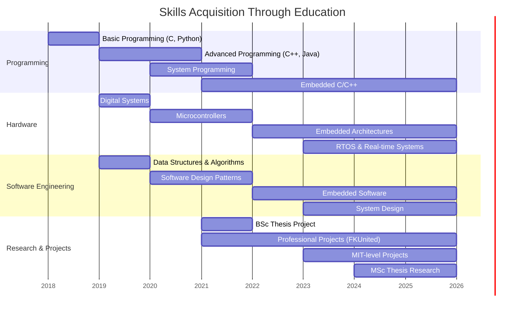

---

## Academic Performance Flow

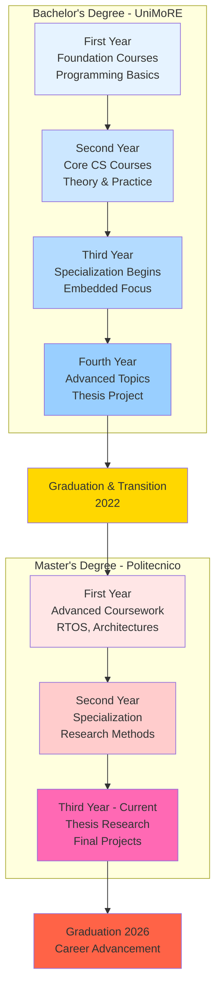

---

## Course Categories & Specialization

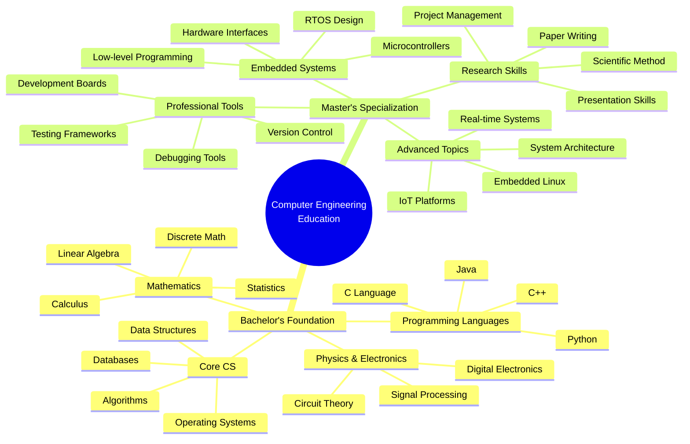

---

## Learning Progression Chart

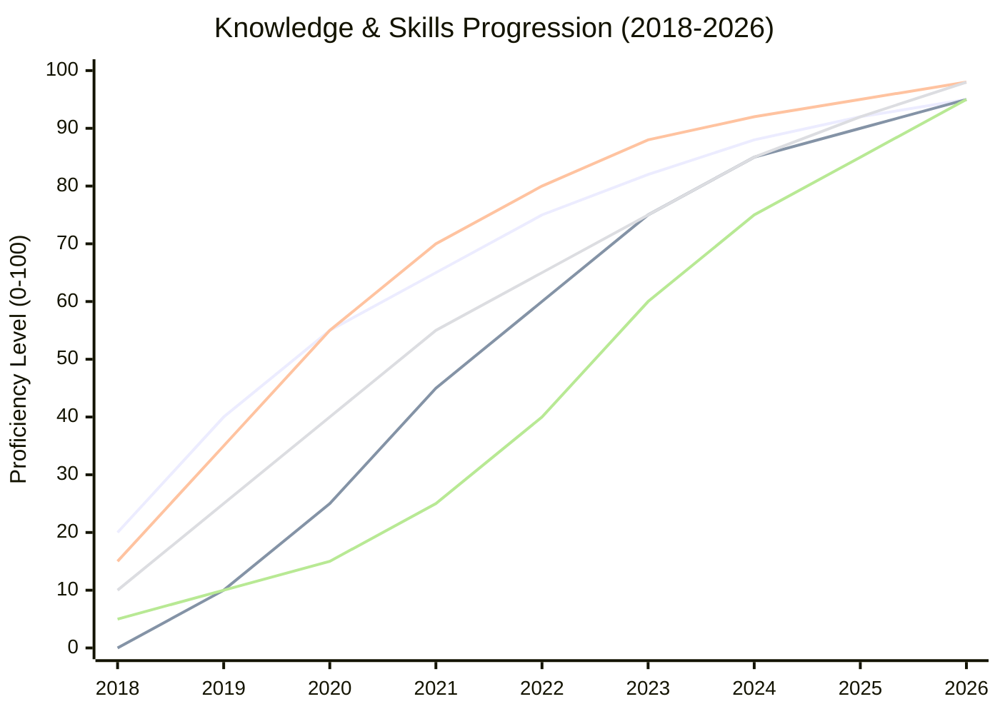

---

## Degree Comparison Matrix

| Aspect | BSc (UniMoRE) | MSc (PoliMi) |
|--------|---------------|--------------|
| **Institution** | University of Modena & Reggio Emilia | Politecnico di Milano |
| **Location** | Modena, Italy | Milan, Italy |
| **Duration** | 2018-2022 (4 years) | 2022-2026 (4 years) |
| **Degree Type** | Bachelor of Science | Master of Science |
| **Field** | Computer Engineering | Computer Engineering |
| **Specialization** | General CS | Embedded Systems |
| **Status** | ✅ Completed | 🔄 In Progress (Final Year) |
| **Key Focus** | Foundations & Core CS | Advanced & Specialized |
| **Thesis** | Bachelor's Project | Master's Research Thesis |
| **Career Impact** | Entry-level Engineer | Senior/Expert Level |

---

## Key Academic Achievements

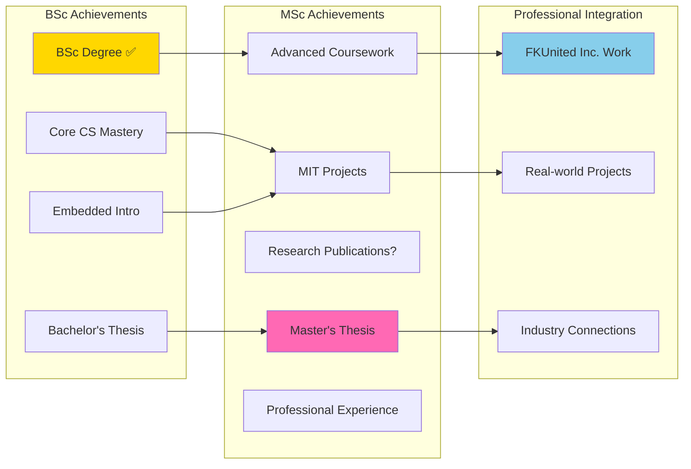

---

## Study Abroad Journey

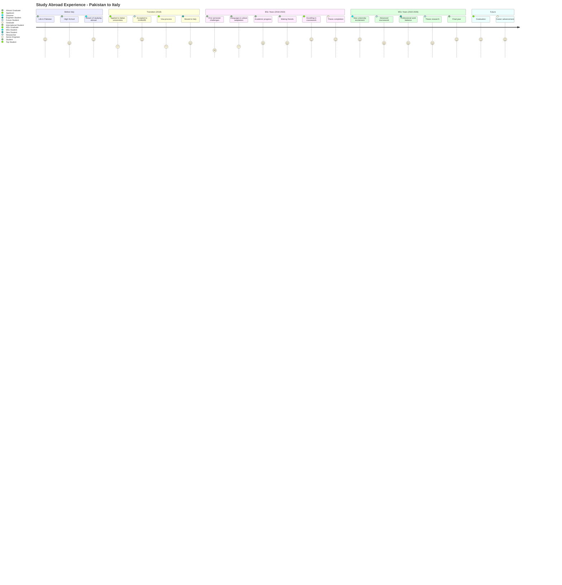

---

## Educational Philosophy

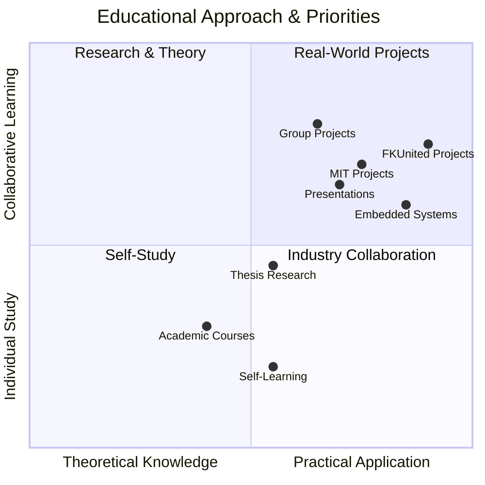

---

## Future Educational Possibilities

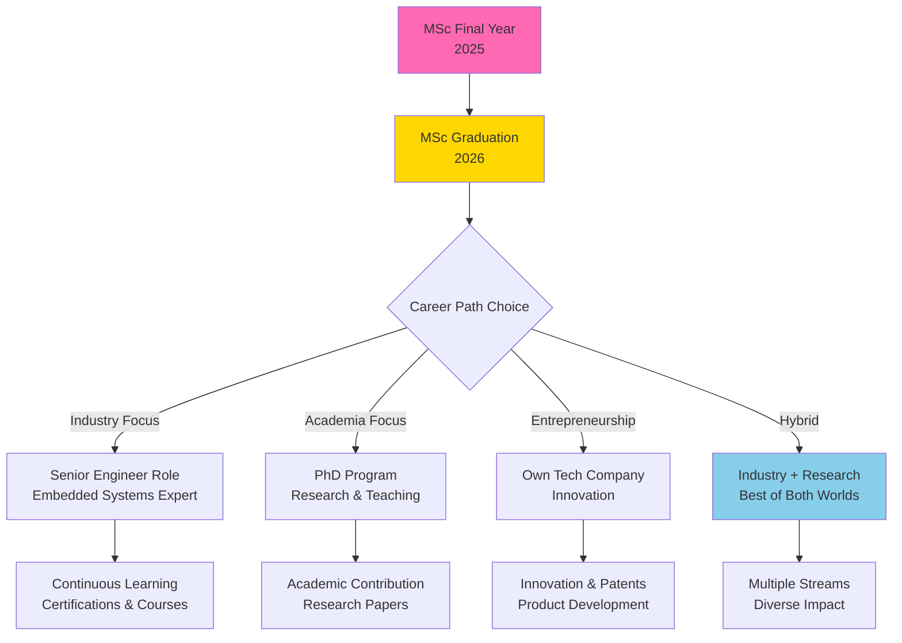

---

## Key Takeaways

### Educational Statistics
- **Total Years of Engineering Education:** 8 years (2018-2026)
- **Countries Studied:** Italy 🇮🇹
- **Degrees Earned/In Progress:** 2 (BSc ✅, MSc 🔄)
- **Universities Attended:** 2 (UniMoRE, PoliMi)
- **Specialization:** Embedded Systems

### Core Competencies Developed
1. **Programming:** C, C++, Python, Java, Embedded C
2. **Hardware:** Microcontrollers, RTOS, Embedded Architectures
3. **Software:** Design Patterns, System Programming, Real-time Systems
4. **Research:** Scientific Method, Technical Writing, Presentations
5. **Professional:** Project Management, Team Collaboration, Industry Standards

### Unique Aspects
- International student experience (Pakistan → Italy)
- Simultaneous academic + professional growth (FKUnited Inc.)
- Focus on practical applications (Embedded Systems)
- MIT-level project involvement
- Balance of theory and practice

---

*This education pathway represents a journey of continuous growth and learning.*  
*Last Updated: December 17, 2025*
