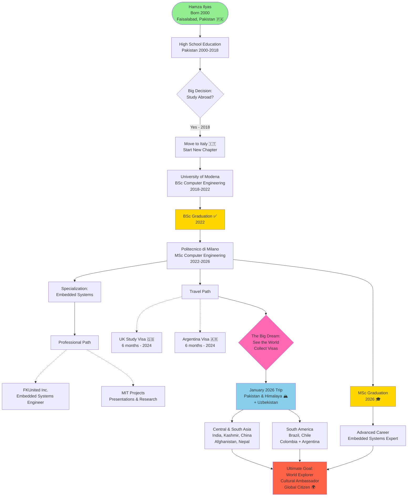
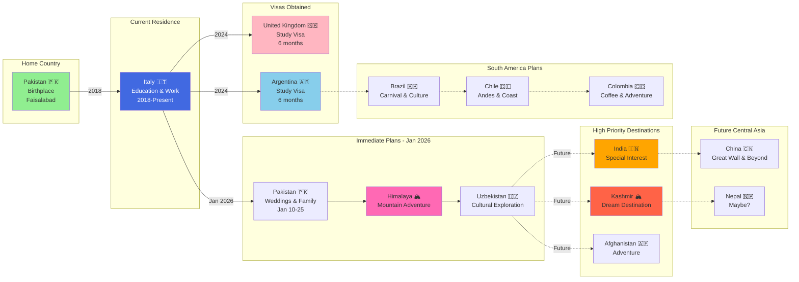
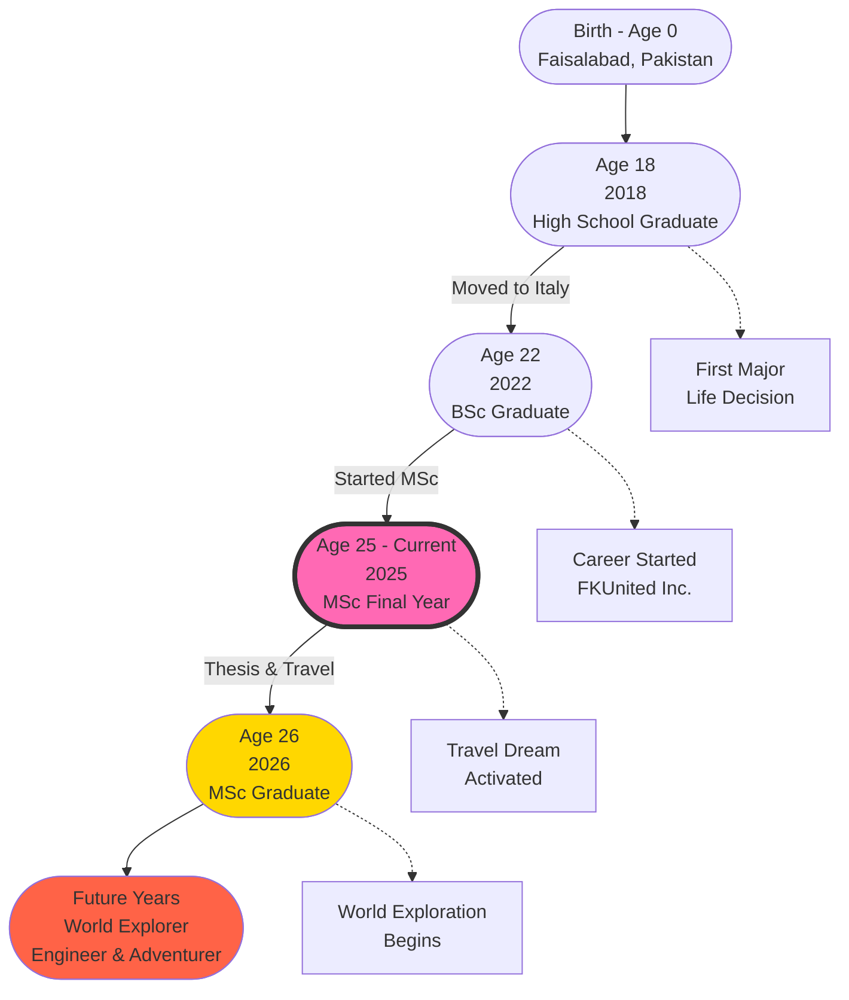
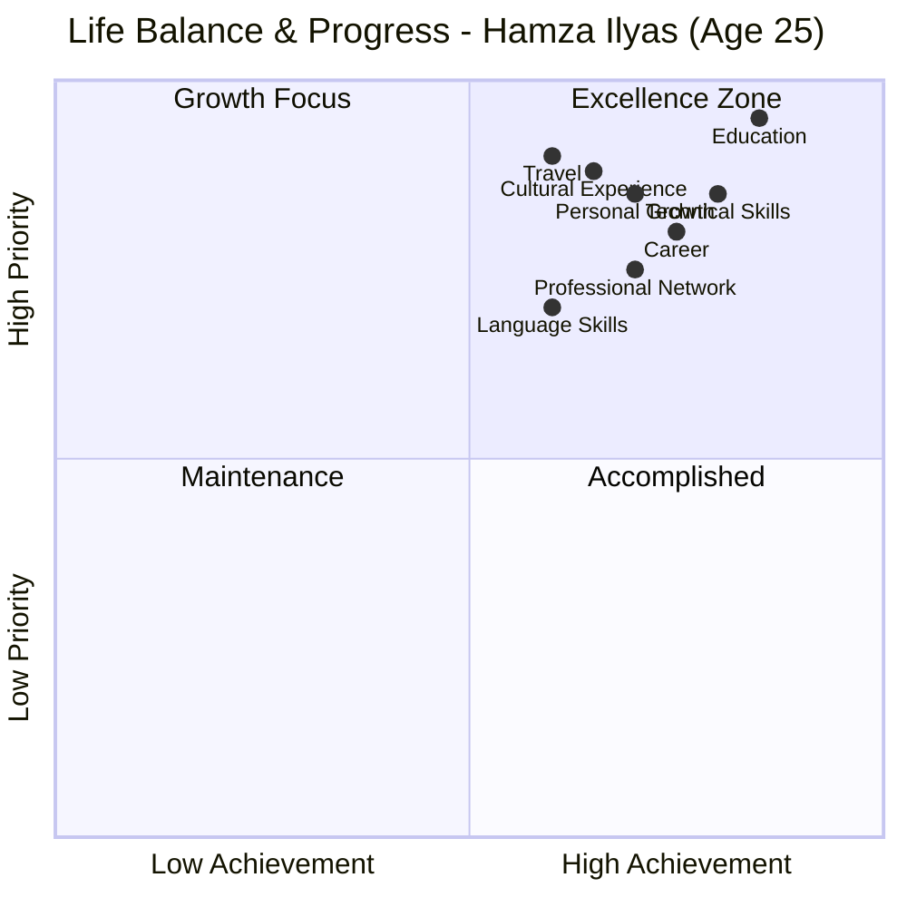
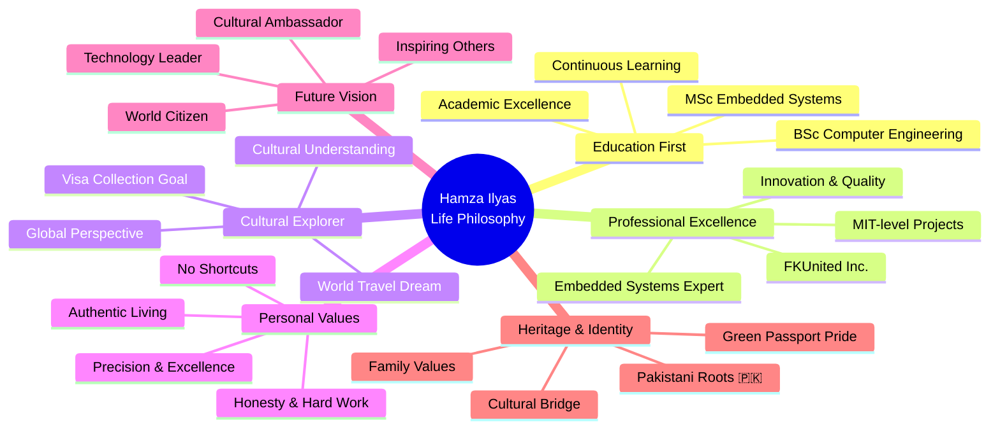
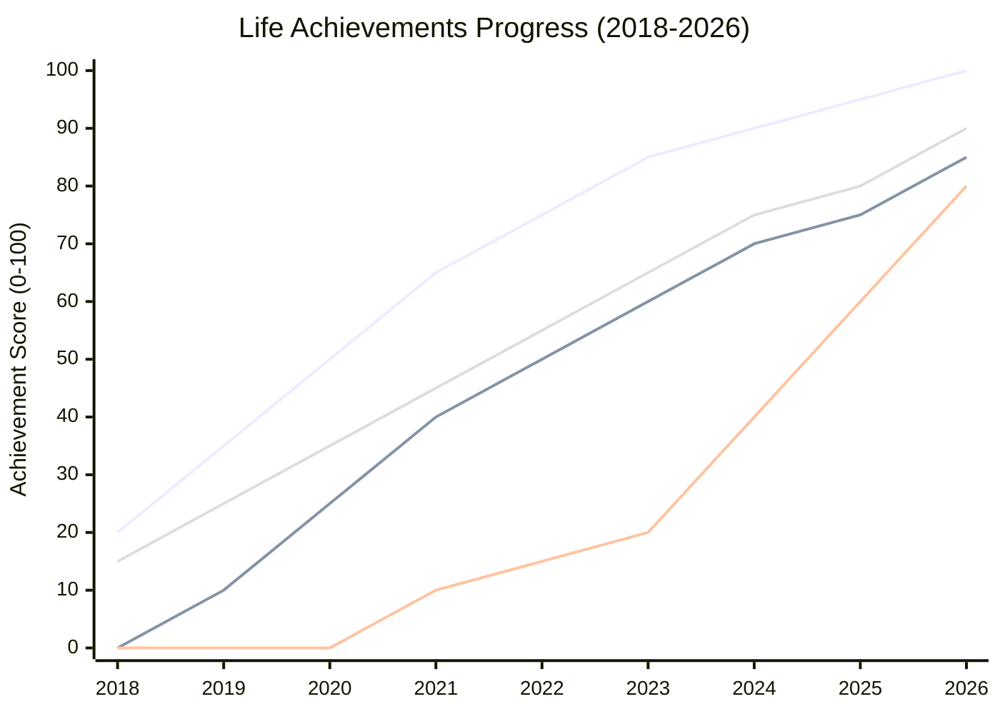

# Life Journey Timeline - Hamza Ilyas

## Visual Timeline Diagram

This diagram illustrates the major milestones in Hamza Ilyas's life journey from birth to present day and future aspirations.

---

## Interactive Timeline

```mermaid
timeline
    title Life Journey of Hamza Ilyas - 25 Years of Dreams & Achievements
    
    section Birth & Early Life (2000-2018)
        2000 : Born in Faisalabad, Pakistan 🇵🇰
             : Pakistani citizenship (Green Passport)
        2018 : Completed High School
             : Moved to Italy for higher education 🇮🇹
    
    section Undergraduate Journey (2018-2022)
        2018-2019 : Started BSc Computer Engineering
                  : University of Modena and Reggio Emilia (UniMoRE)
        2019-2021 : Core engineering studies
                  : Programming & embedded systems focus
        2021-2022 : Final year projects
                  : Graduated with BSc in Computer Engineering ✅
    
    section Professional Growth (2020-Present)
        2020 : Started working on embedded systems
        2021 : Joined FKUnited Inc.
             : Embedded Systems Engineer role
        2022-Present : Continued professional development
                     : MIT-level projects & presentations
    
    section Master's Degree (2022-2026)
        2022 : Enrolled at Politecnico di Milano
             : MSc Computer Engineering
             : Specialization: Embedded Systems
        2023-2024 : Advanced coursework
                  : Research projects
        2024-2025 : Final year studies (Current)
                  : Thesis preparation
        2026 : Expected graduation 🎓
    
    section Travel & Exploration (2024-Present)
        2024 : UK Study Visa obtained 🇬🇧
             : 6-month visa approved
        2024 : Argentina Study Visa obtained 🇦🇷
             : 6-month visa approved
        2025 : Planning world travel journey
             : Visa collection mission begins
        Jan 2026 : Pakistan & Himalaya Trip 🏔️
                 : Uzbekistan journey
    
    section Future Aspirations (2026+)
        2026 : Graduate with MSc
             : India & Kashmir visas (Goal)
        2027 : China, Afghanistan, Nepal travels
             : Central Asia exploration
        2028+ : South America journey
              : Brazil, Chile, Colombia
              : Continue visa collection worldwide
```

---

## Detailed Journey Flowchart

---

## Geographical Journey Map

---

## Age Milestones

---

## Key Life Domains Progress

---

## Life Philosophy Journey

---

## Success Metrics Over Time

---

## Notes

### Key Characteristics
- **Age:** 25 years old (as of 2025)
- **Nationality:** Pakistani 🇵🇰
- **Passport:** Green passport (Pakistani)
- **Current Status:** MSc Student & Embedded Systems Engineer

### Life Motto
*"See the world and collect each country's visas, especially India & Kashmir!"*

### Defining Moments
1. **2018:** Decision to study abroad (Italy)
2. **2022:** BSc graduation & MSc enrollment
3. **2024:** First international visas (UK & Argentina)
4. **2026:** Planned Himalaya journey & MSc graduation

### Future Timeline
- **Short-term (2026):** Complete MSc, India & Kashmir visas
- **Medium-term (2027-2028):** Central Asia exploration
- **Long-term (2028+):** South America & worldwide travels

---

*This timeline represents a living document of Hamza's journey.*  
*Updated regularly as new milestones are achieved.*  
*Last Updated: December 17, 2025*
