# Professional Journey - Hamza Ilyas

## Career Development & Technical Excellence

This document visualizes Hamza Ilyas's professional journey as a Field Service Engineer at Tomra Recycling and CEO of FKUnited Engineering Consulting, along with his growth in the technology field.

---

## Professional Timeline

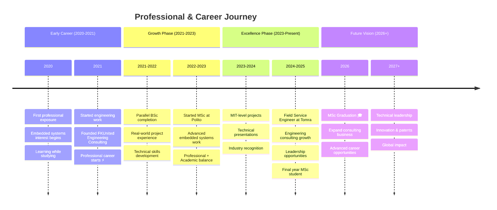

---

## Career Path Flow

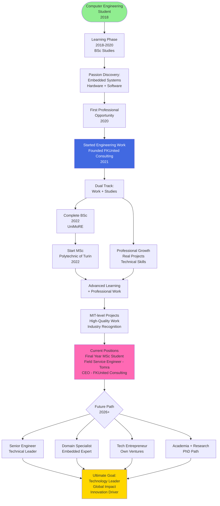

---

## Technical Skills Evolution

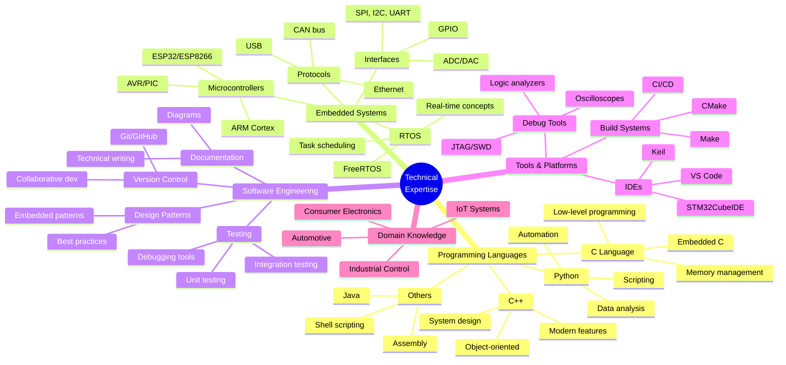

---

## Skills Progression Chart

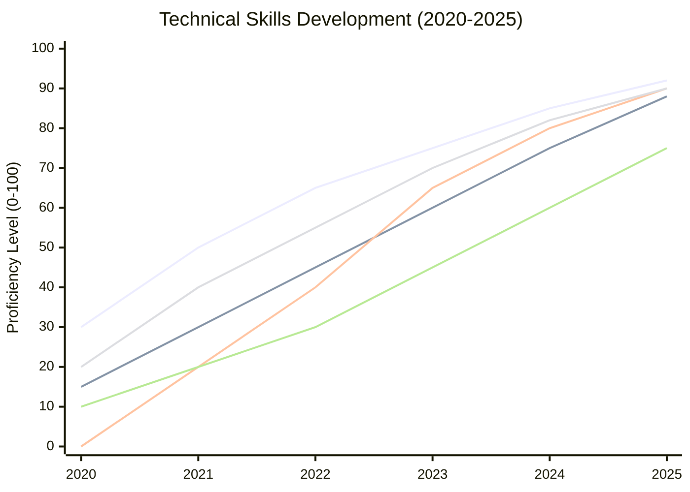

---

## Professional Experience Journey

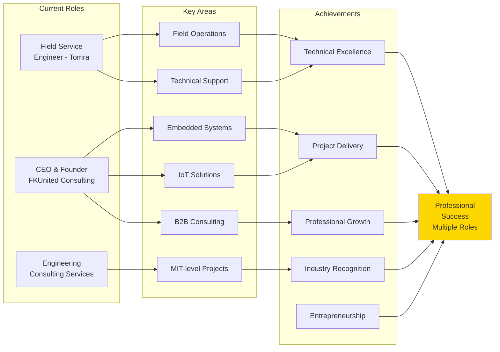

---

## Work-Study Balance

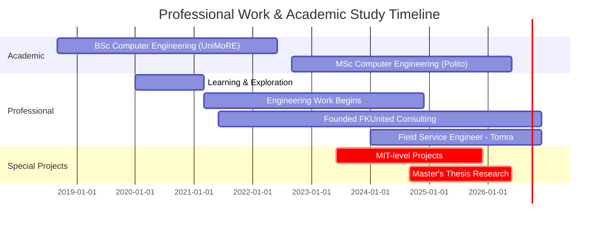

---

## Professional Competency Matrix

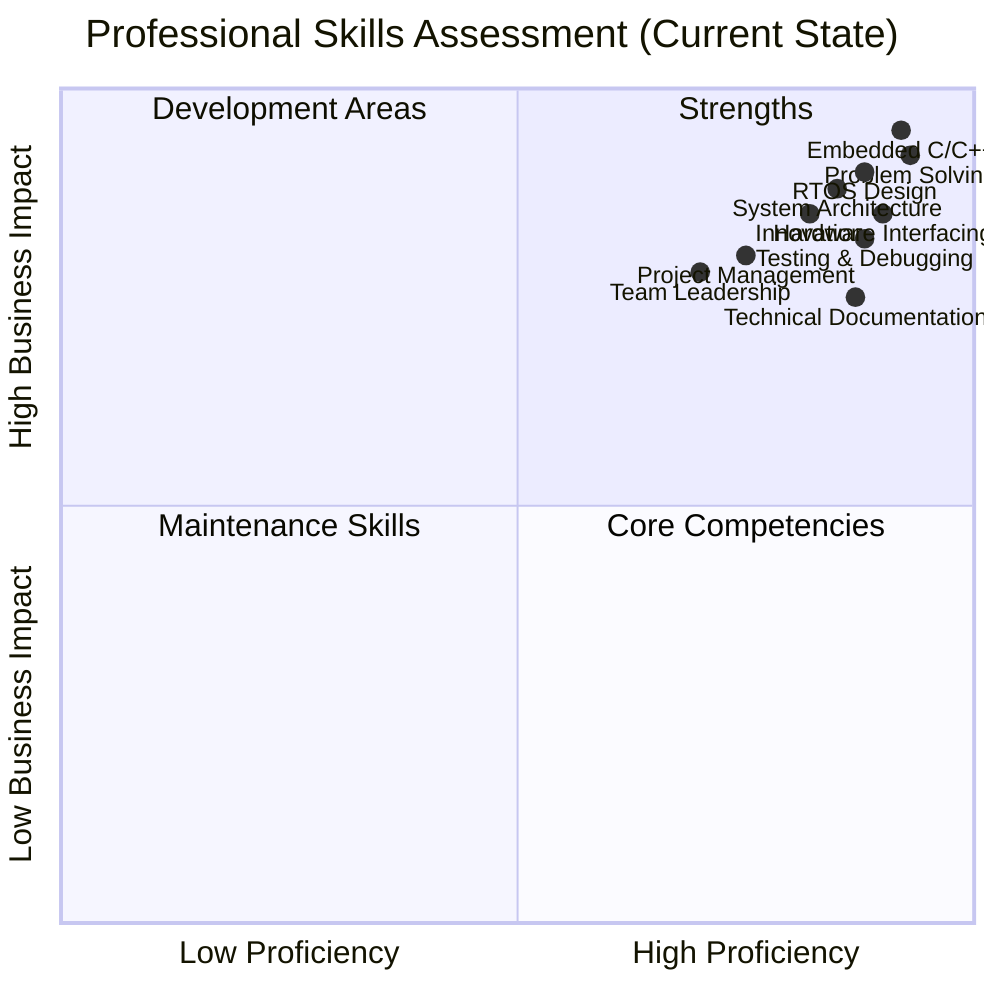

---

## Project Categories

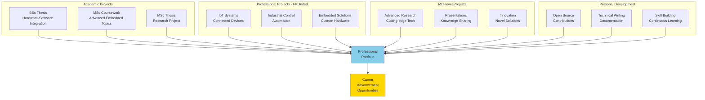

---

## Professional Values & Ethics

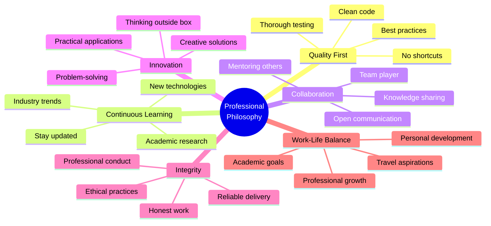

---

## Industry Knowledge Areas

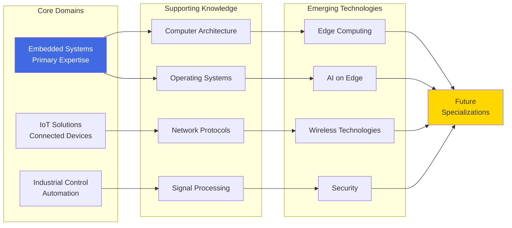

---

## Career Achievements Timeline

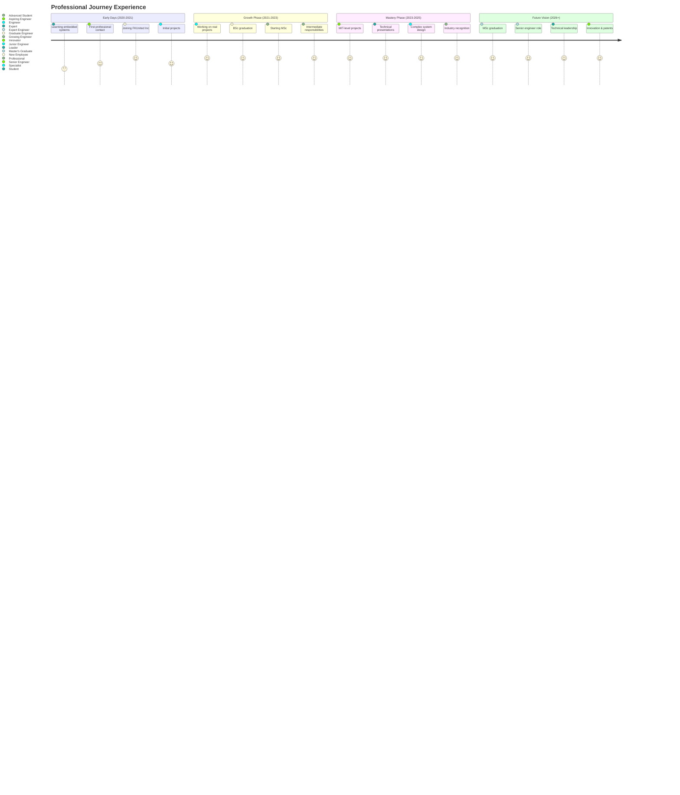

---

## Professional Network

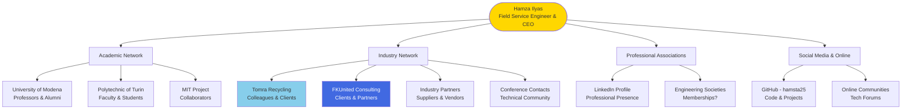

---

## Technical Presentations & Communication

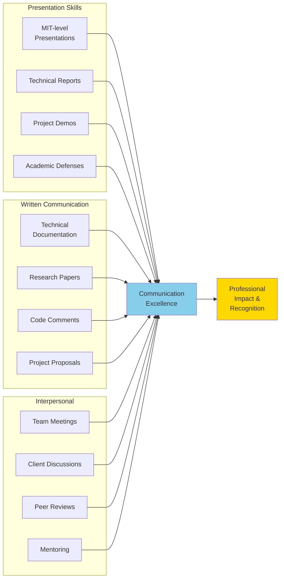

---

## Future Career Trajectory

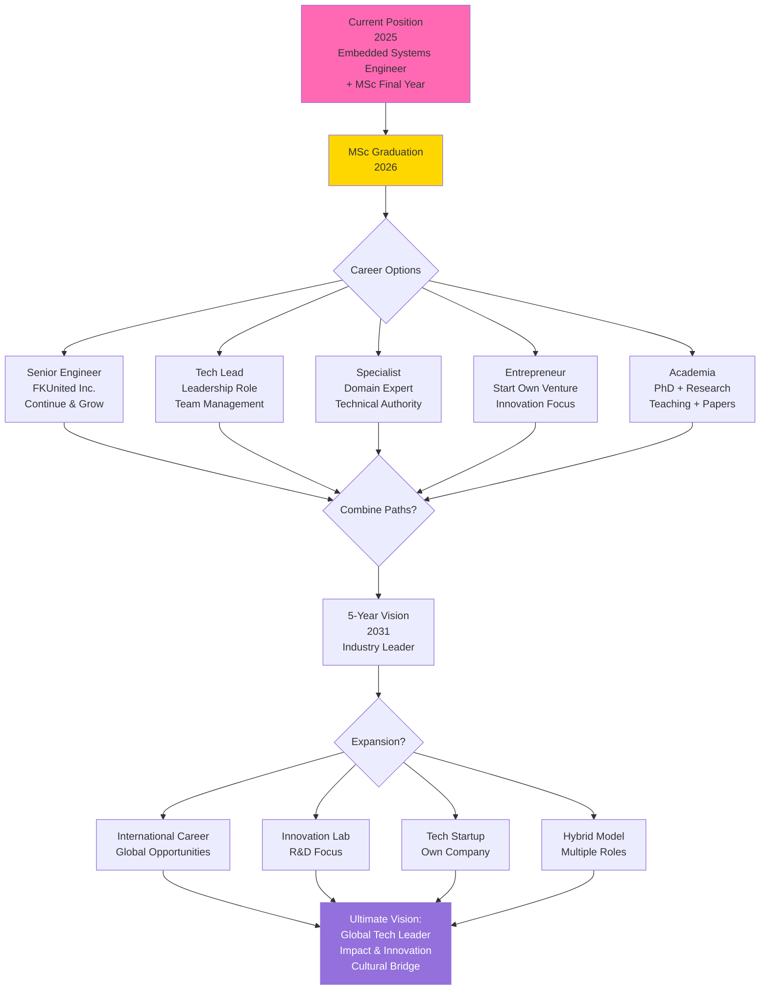

---

## Work Philosophy

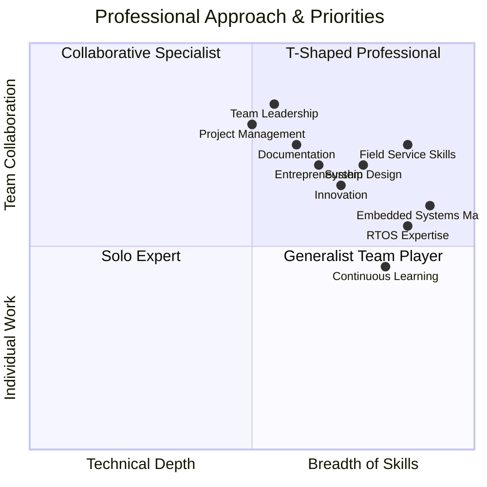

---

## Key Differentiators

### What Makes Hamza Unique?

1. **Dual Excellence:** Academic rigor + Professional experience
2. **Entrepreneurship:** CEO and Founder of engineering consulting company
3. **Cultural Bridge:** Pakistani identity + Italian education + Global vision
4. **Balanced Perspective:** Theory + Practice
5. **Youth & Ambition:** 25 years old with diverse professional experience
6. **Global Mindset:** International education & travel aspirations
7. **Continuous Growth:** Never-ending learning attitude
8. **Quality Focus:** No shortcuts, professional integrity
9. **MIT-Level Work:** High-quality project delivery

---

## Professional Statistics

### Current Metrics (2025)
- **Age:** 25 years
- **Total Experience:** Diverse professional experience (2021-2025)
- **Current Roles:** Field Service Engineer @ Tomra Recycling, CEO @ FKUnited Engineering Consulting
- **Education Level:** MSc Computer Engineering (Final Year)
- **Specialization:** Embedded Systems, RTOS, Field Service
- **Key Skills:** C/C++, Embedded Systems, RTOS, System Design, Technical Support

### Target Metrics (2030)
- **Experience:** 9+ years
- **Role:** Senior/Lead Engineer, Expanded Consulting Business, or Technical Director
- **Expertise:** Recognized domain expert
- **Publications:** Technical papers, presentations
- **Network:** Global professional network
- **Impact:** Industry-leading innovations

---

## Professional Development Plan

### Short-term (2025-2026)
- ✅ Complete MSc thesis
- 🎯 Graduate with excellent grades
- 🎯 Advance at FKUnited Inc.
- 🎯 Complete MIT projects
- 🎯 Technical publications

### Medium-term (2026-2028)
- 🎯 Senior engineer certification
- 🎯 Leadership responsibilities
- 🎯 Industry recognition
- 🎯 Conference presentations
- 🎯 Mentoring junior engineers

### Long-term (2028-2030+)
- 🎯 Technical leadership role
- 🎯 Innovation & patents
- 🎯 Possible PhD (if academic path)
- 🎯 Own tech venture (if entrepreneurial)
- 🎯 International impact

---

*This professional journey represents dedication, hard work, and continuous excellence.*  
*From student to engineer to future leader - the journey continues.*  
*Last Updated: December 17, 2025*
