# Travel Roadmap - Hamza Ilyas's World Journey

## The Visa Collection Dream 🌍

This document visualizes Hamza Ilyas's ambitious travel plans and visa collection journey across continents.

---

## World Travel Vision Map

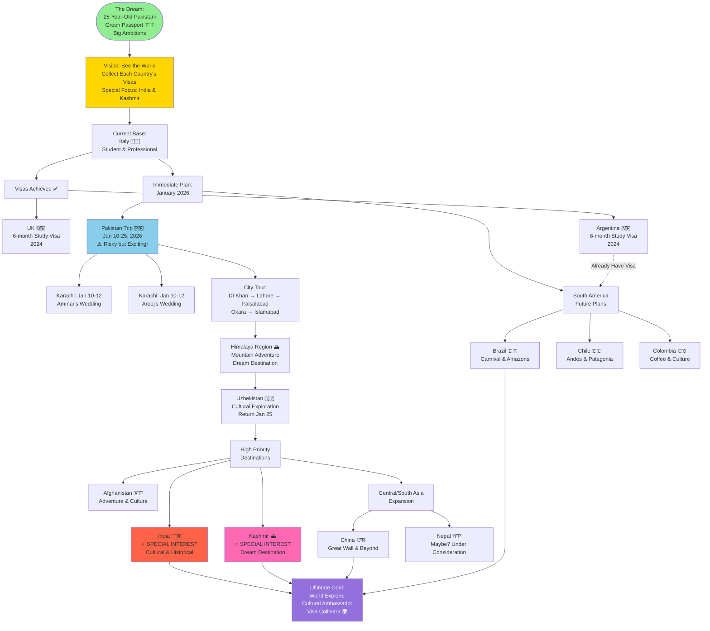

---

## Geographic Distribution of Travel Plans

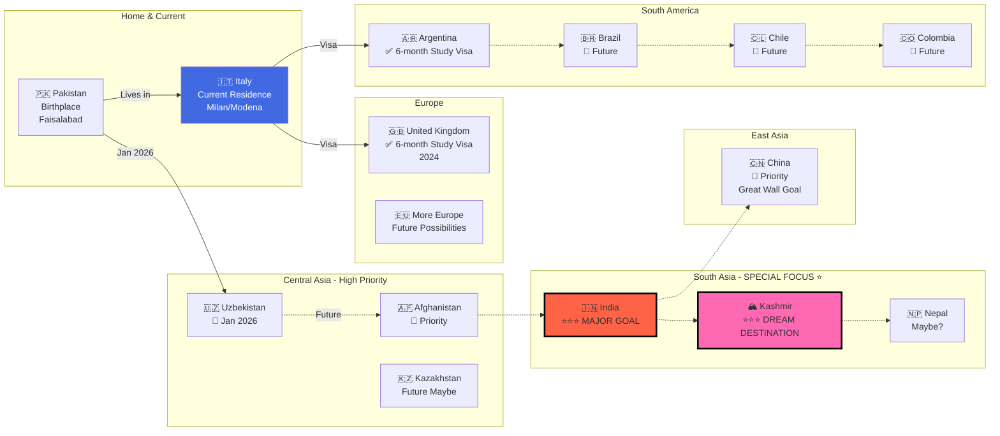

---

## January 2026 Trip - Detailed Itinerary

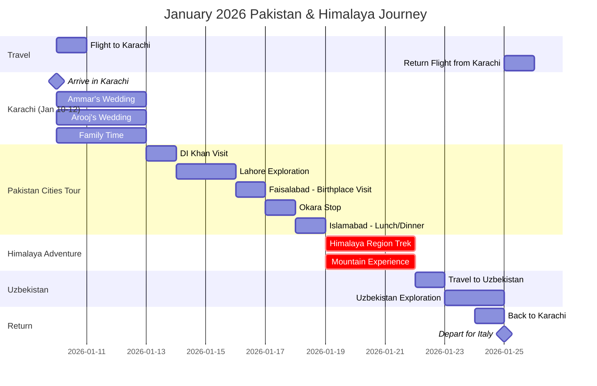

---

## Travel Timeline by Priority

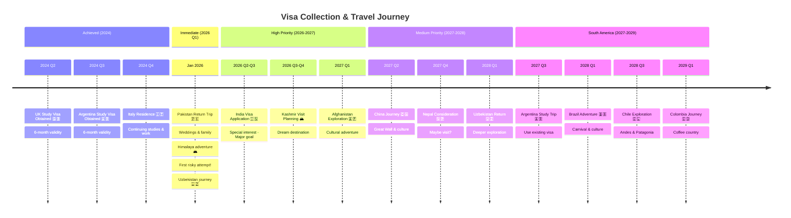

---

## Visa Status Tracker

```mermaid
graph TB
    subgraph "Visas Obtained ✅"
        V1[🇮🇹 Italy<br/>Residence Permit<br/>✅ Active]
        V2[🇬🇧 United Kingdom<br/>6-month Study<br/>✅ Obtained 2024]
        V3[🇦🇷 Argentina<br/>6-month Study<br/>✅ Obtained 2024]
    end
    
    subgraph "In Progress / Planning 🔄"
        V4[🇺🇿 Uzbekistan<br/>🔄 For Jan 2026<br/>Applying Soon]
        V5[🇮🇳 India<br/>🔄 High Priority<br/>Special Interest]
        V6[🏔️ Kashmir<br/>🔄 High Priority<br/>Dream Destination]
    end
    
    subgraph "Future Applications 📋"
        V7[🇦🇫 Afghanistan<br/>📋 2026-2027]
        V8[🇨🇳 China<br/>📋 2027]
        V9[🇳🇵 Nepal<br/>📋 Maybe 2027]
        V10[🇧🇷 Brazil<br/>📋 2028]
        V11[🇨🇱 Chile<br/>📋 2028]
        V12[🇨🇴 Colombia<br/>📋 2029]
    end
    
    V1 --> Active[Current Status:<br/>3 Active Visas/Permits]
    V2 --> Active
    V3 --> Active
    
    V4 --> Planning[Planning Phase:<br/>3 Countries]
    V5 --> Planning
    V6 --> Planning
    
    V7 --> Future[Future Goals:<br/>6+ Countries]
    V8 --> Future
    V9 --> Future
    V10 --> Future
    V11 --> Future
    V12 --> Future
    
    style V1 fill:#90EE90
    style V2 fill:#90EE90
    style V3 fill:#90EE90
    style V5 fill:#FF6347
    style V6 fill:#FF69B4
```

---

## Risk Assessment - January 2026 Trip

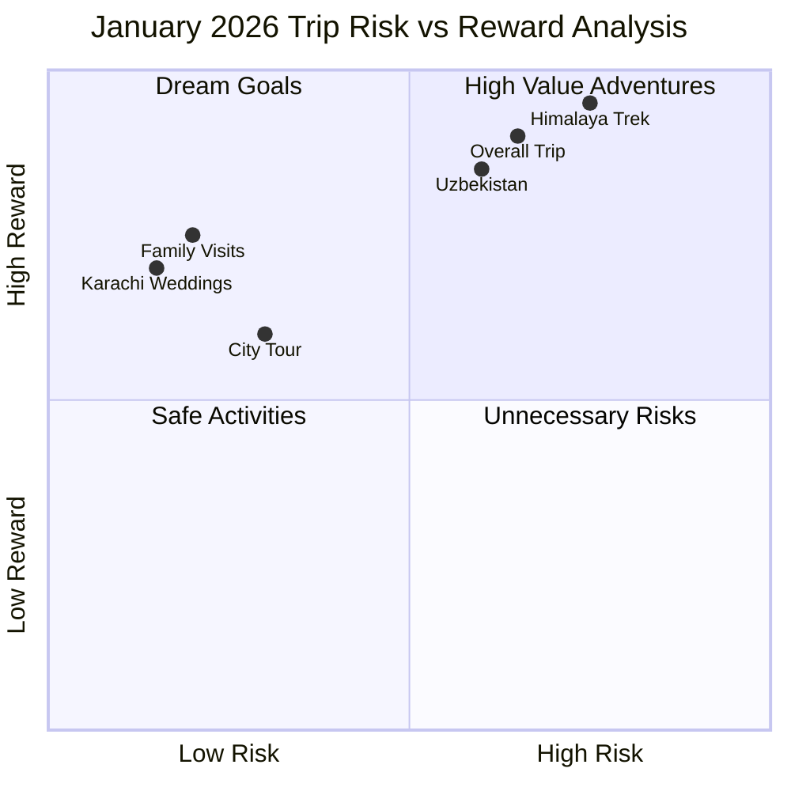

---

## Travel Motivation Mind Map

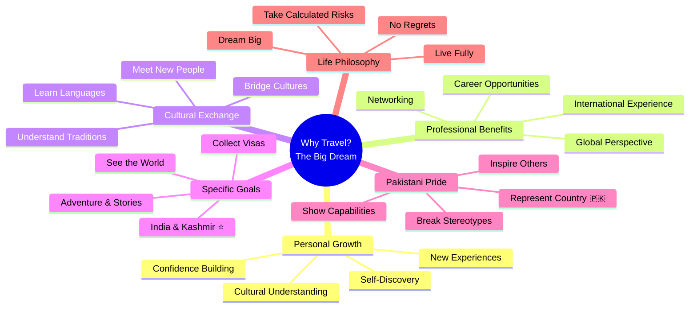

---

## Destination Categories

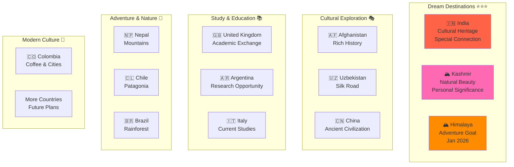

---

## Travel Statistics & Goals

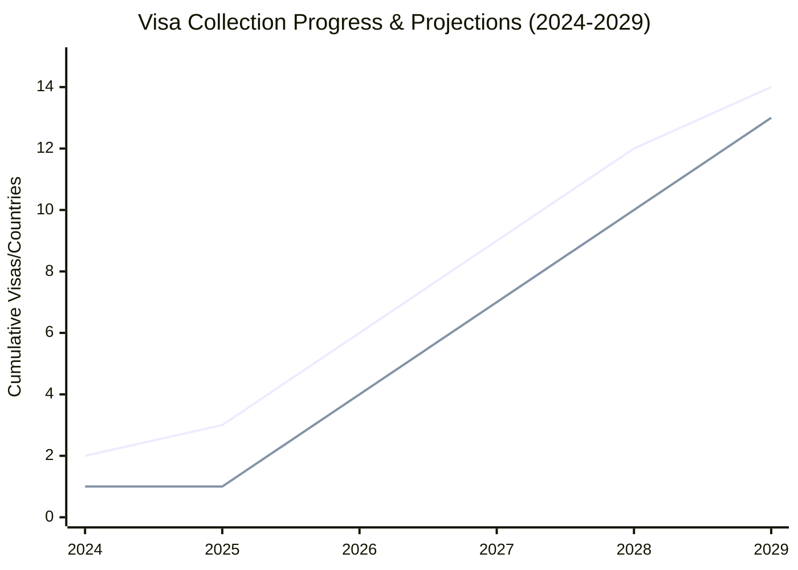

---

## Challenges & Solutions

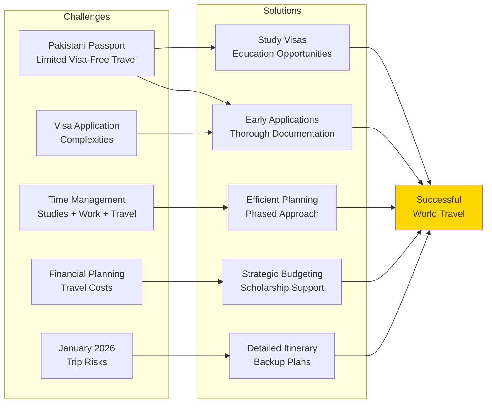

---

## Pakistan City Tour - January 2026

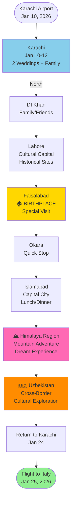

---

## Travel Philosophy

> **"A 25-year-old Pakistani engineer with a green passport 🇵🇰 and a big dream: See the world and collect each country's visas, especially India & Kashmir!"**

### Core Values
1. **Authenticity:** Travel for genuine cultural exchange
2. **Adventure:** Embrace calculated risks (like Jan 2026 trip!)
3. **Learning:** Every destination is a classroom
4. **Connection:** Building bridges between cultures
5. **Representation:** Proud Pakistani ambassador

### Special Focus: India & Kashmir

**Why India?**
- Deep cultural and historical connections
- Shared heritage and similar traditions
- Personal interest in subcontinental culture
- Professional networking opportunities

**Why Kashmir?**
- Natural beauty and mountain landscapes
- Historical significance
- Personal dream destination
- Adventure and exploration

---

## Future Expansion Possibilities

### Africa (Future Consideration)
- 🇪🇬 Egypt - Pyramids & History
- 🇿🇦 South Africa - Diverse Landscapes
- 🇰🇪 Kenya - Safari & Wildlife

### Middle East (Future Consideration)
- 🇦🇪 UAE - Modern Architecture
- 🇹🇷 Turkey - East Meets West
- 🇯🇴 Jordan - Petra & History

### More Europe (Future Consideration)
- 🇫🇷 France - Art & Culture
- 🇩🇪 Germany - Technology & History
- 🇪🇸 Spain - Architecture & Food

### North America (Future Consideration)
- 🇺🇸 USA - Innovation Hub
- 🇨🇦 Canada - Natural Beauty
- 🇲🇽 Mexico - Ancient Civilizations

---

## Key Metrics

### Current Stats (December 2025)
- **Age:** 25 years
- **Passport:** Pakistani 🇵🇰 (Green Passport)
- **Current Residence:** Italy 🇮🇹
- **Active Visas:** 3 (Italy residence, UK, Argentina)
- **Countries Lived In:** 2 (Pakistan, Italy)
- **Continents Visited:** 2 (Asia, Europe)

### Target Stats (2030)
- **Visas Collected:** 20+
- **Countries Visited:** 25+
- **Continents Visited:** 5+
- **Special Achievement:** India & Kashmir ✅

---

*This travel roadmap is a living document, updated as new adventures unfold.*  
*The journey of a thousand miles begins with a single visa application!*  
*Last Updated: December 17, 2025*
