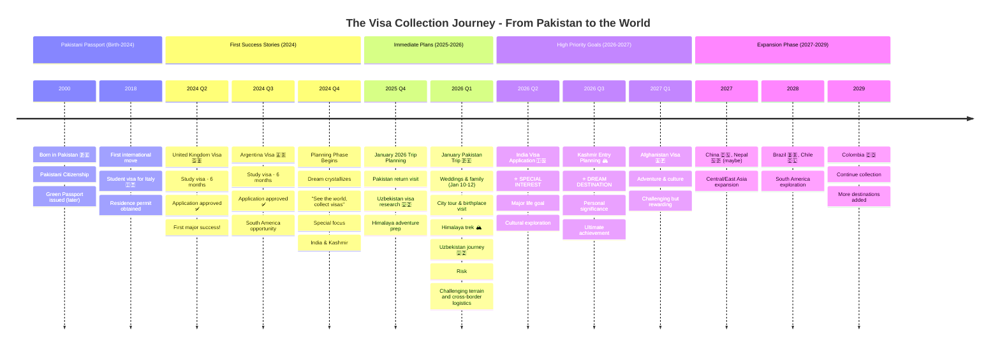
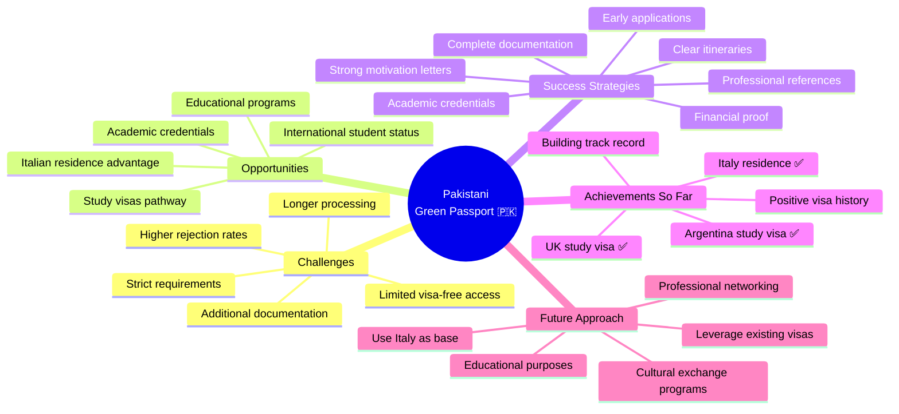
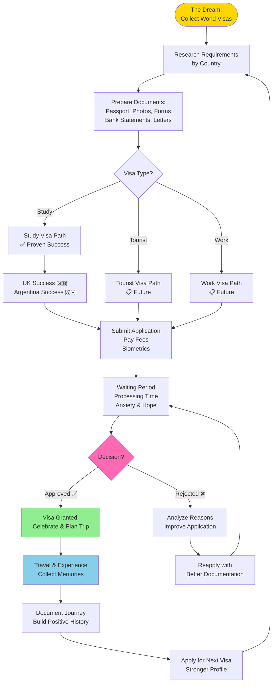
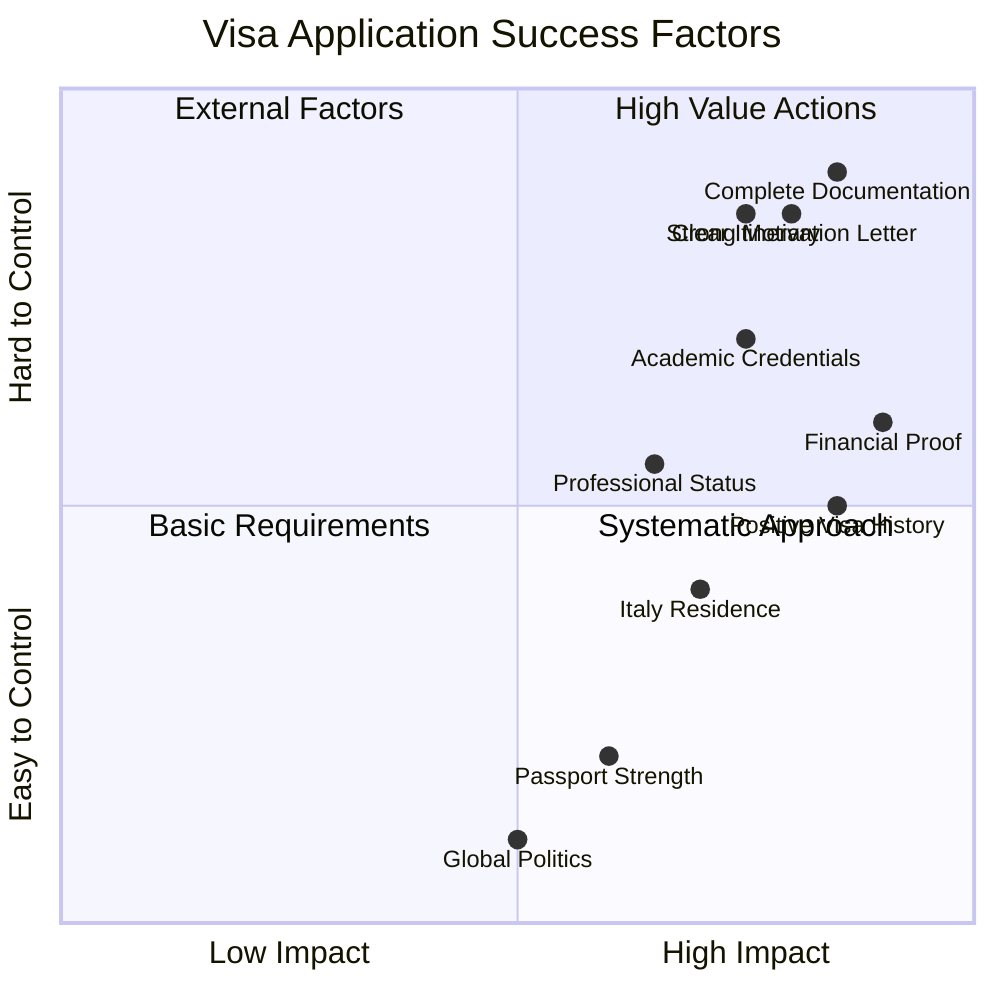
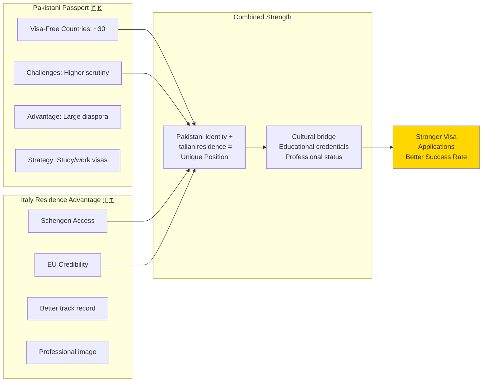
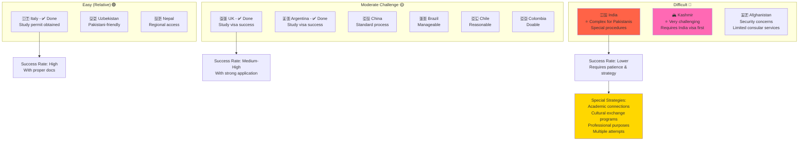
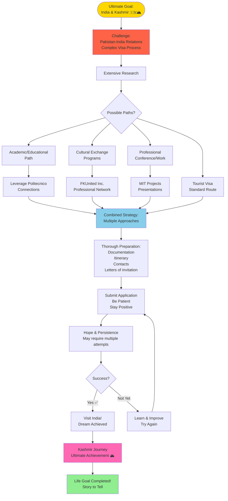
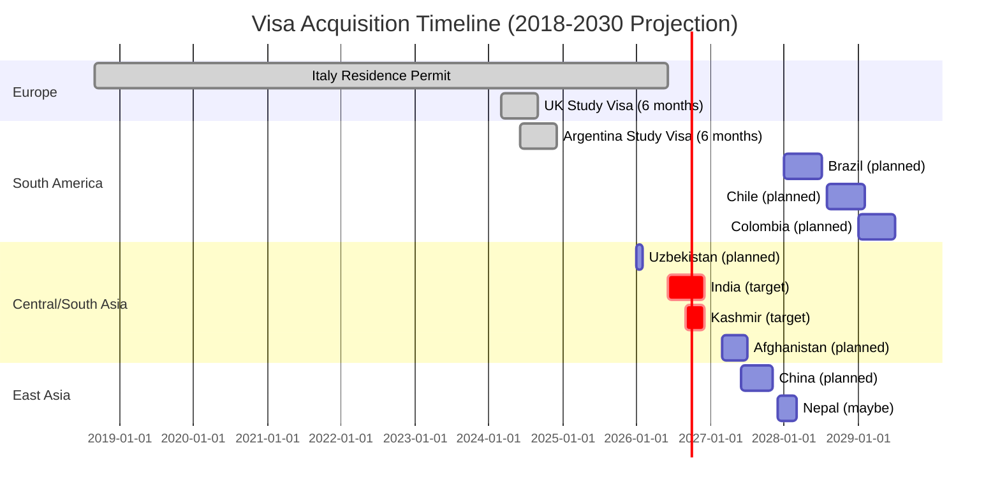
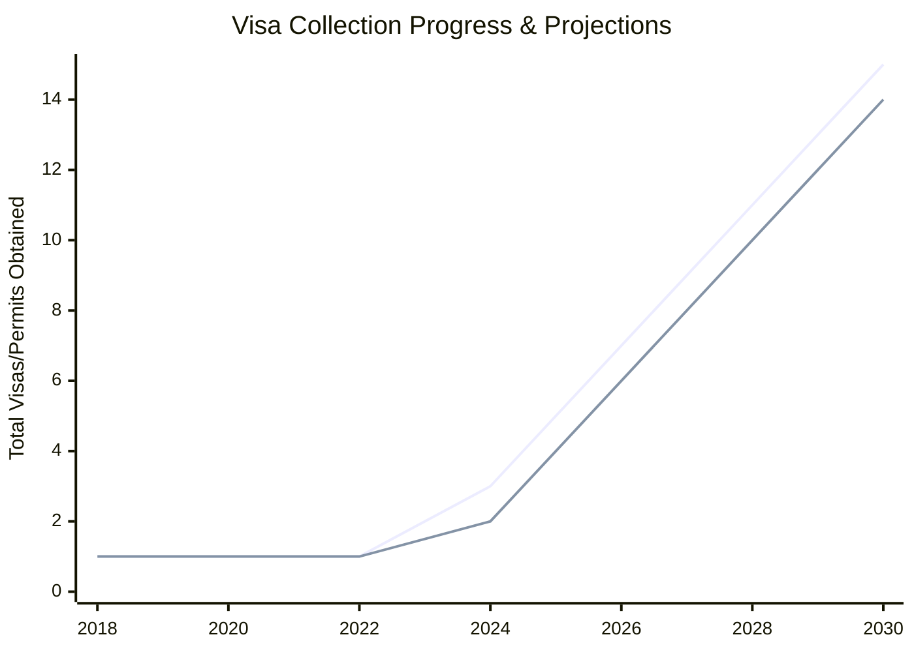
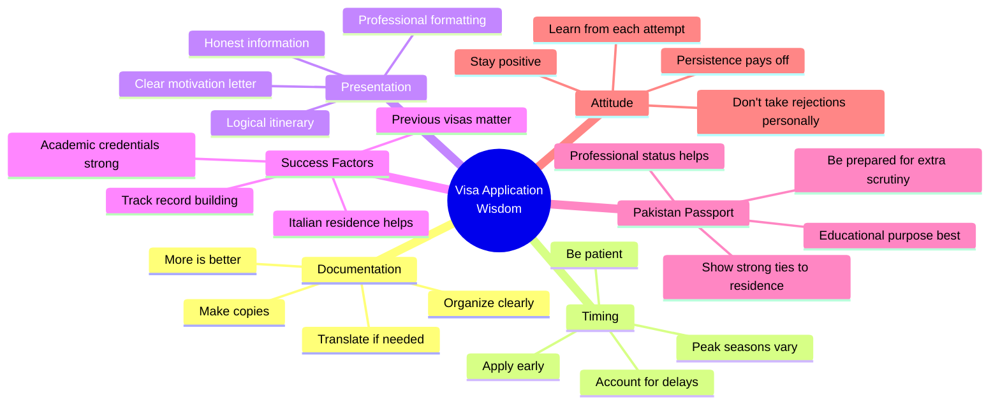

# Visa Journey Tracker - Hamza Ilyas

## The Passport & Visa Collection Story 🌍

This document tracks the complete visa journey of a 25-year-old Pakistani with ambitious dreams to explore the world.

---

## Visa Collection Timeline



---

## Visa Status Dashboard

```mermaid
graph TB
    Main([Hamza Ilyas<br/>Pakistani Passport 🇵🇰<br/>Age: 25])
    
    Main --> Category1[Residence/Long-term]
    Main --> Category2[Study Visas]
    Main --> Category3[Tourist/Travel]
    Main --> Category4[Planning Stage]
    
    Category1 --> Italy[🇮🇹 Italy<br/>Residence Permit<br/>✅ Active<br/>For studies & work]
    
    Category2 --> UK[🇬🇧 United Kingdom<br/>6-month Study Visa<br/>✅ Obtained 2024<br/>University of Exeter<br/>Approved via UniMoRE]
    Category2 --> Argentina[🇦🇷 Argentina<br/>6-month Study Visa<br/>✅ Obtained 2024<br/>UNC Córdoba (FAMAF & FCEFyN)<br/>Approved via Polito]
    
    Category3 --> Planning1[No tourist visas yet<br/>Focus on study/education<br/>Travel will follow]
    
    Category4 --> Uzbek[🇺🇿 Uzbekistan<br/>🔄 In Planning<br/>Jan 2026 trip<br/>Application pending]
    Category4 --> India[🇮🇳 India<br/>🔄 High Priority<br/>⭐ Special Interest<br/>Application planned]
    Category4 --> Kashmir[🏔️ Kashmir<br/>🔄 High Priority<br/>⭐ Dream Goal<br/>Planning stage]
    Category4 --> Afghan[🇦🇫 Afghanistan<br/>📋 Future Plan<br/>2027 target]
    Category4 --> More[Many More...<br/>China, Nepal, Brazil<br/>Chile, Colombia, etc.]
    
    style Main fill:#90EE90
    style Italy fill:#4169E1,color:#fff
    style UK fill:#FFB6C1
    style Argentina fill:#87CEEB
    style India fill:#FF6347
    style Kashmir fill:#FF69B4
```

---

## Pakistani Passport Challenges & Strategies



---

## Visa Application Journey Flow



---

## Visa Success Factors



---

## Comparison: Pakistan vs Italy Passport Power



---

## Detailed Visa Status Table

### Obtained Visas ✅

| Country | Type | Duration | Obtained | Status | Notes |
|---------|------|----------|----------|--------|-------|
| 🇮🇹 **Italy** | Residence Permit | Multi-year | 2018 | ✅ Active | For MSc studies at Politecnico |
| 🇬🇧 **United Kingdom** | Study Visa | 6 months | 2024 | ✅ Obtained | Education opportunity |
| 🇦🇷 **Argentina** | Study Visa | 6 months | 2024 | ✅ Obtained | Research & learning |

### In Progress / Planning 🔄

| Country | Type | Priority | Target Date | Status | Notes |
|---------|------|----------|-------------|--------|-------|
| 🇺🇿 **Uzbekistan** | Tourist | High | Jan 2026 | 🔄 Planning | Part of Jan trip |
| 🇮🇳 **India** | Tourist/Study | ⭐ Highest | 2026 Q2-Q3 | 🔄 Planning | SPECIAL INTEREST |
| 🏔️ **Kashmir** | Entry Permit | ⭐ Highest | 2026 Q3-Q4 | 🔄 Planning | DREAM DESTINATION |
| 🇦🇫 **Afghanistan** | Tourist | High | 2027 Q1 | 📋 Future | Adventure goal |
| 🇨🇳 **China** | Tourist | High | 2027 Q2 | 📋 Future | Great Wall & culture |
| 🇳🇵 **Nepal** | Tourist | Medium | 2027 Q4 | 📋 Maybe | Under consideration |
| 🇧🇷 **Brazil** | Tourist | Medium | 2028 Q1 | 📋 Future | South America |
| 🇨🇱 **Chile** | Tourist | Medium | 2028 Q3 | 📋 Future | South America |
| 🇨🇴 **Colombia** | Tourist | Medium | 2029 Q1 | 📋 Future | South America |

---

## Visa Application Difficulty Scale



---

## India & Kashmir - Special Case Analysis



---

## Visa History Timeline



---

## Success Metrics & Goals



---

## Application Checklist Template

### Standard Documents (All Applications)
- [ ] Valid passport (6+ months validity)
- [ ] Passport-size photos (as per specs)
- [ ] Completed visa application form
- [ ] Travel itinerary
- [ ] Hotel reservations / accommodation proof
- [ ] Travel insurance
- [ ] Return flight tickets (or reservation)

### Financial Documents
- [ ] Bank statements (3-6 months)
- [ ] Proof of employment/student status
- [ ] Income tax returns (if applicable)
- [ ] Sponsorship letter (if applicable)
- [ ] Scholarship documents (for study visas)

### Educational Documents (Study Visas)
- [ ] University acceptance letter
- [ ] Academic transcripts
- [ ] Degree certificates
- [ ] Enrollment confirmation
- [ ] Letter from current university
- [ ] Research proposal (if applicable)

### Special Documents
- [ ] Invitation letters
- [ ] Conference registration (if applicable)
- [ ] Professional references
- [ ] Previous visa copies (positive history)
- [ ] Italy residence permit copy
- [ ] Motivation letter

### Country-Specific
- [ ] Additional forms (varies by country)
- [ ] Specific certifications
- [ ] Medical certificates
- [ ] Police clearance (if required)

---

## Lessons Learned



---

## Future Vision

### 2026 Goals
- ✅ Complete January Pakistan/Himalaya/Uzbekistan trip
- 🎯 Obtain India visa
- 🎯 Visit Kashmir
- 🎯 Add 3-4 new visas to collection

### 2027-2028 Goals
- 🎯 Central Asia expansion (Afghanistan, China)
- 🎯 South America journey (Brazil, Chile)
- 🎯 Add 5-6 new countries
- 🎯 Build strong travel portfolio

### 2029-2030 Vision
- 🎯 15+ countries visited
- 🎯 All continents except Antarctica (maybe?)
- 🎯 Strong international network
- 🎯 Cultural ambassador status
- 🎯 Inspiring others from Pakistan

---

## Motivational Quotes

> **"A 25-year-old Pakistani engineer with a green passport 🇵🇰 and a big dream: See the world and collect each country's visas, especially India & Kashmir!"**

> **"The world is a book, and those who do not travel read only one page."**

> **"Every visa is a story. Every stamp is a memory. Every journey is a lesson."**

> **"First attempt Jan 2026, might be risky! But that's what makes it an adventure."**

---

## Statistics Summary

### Current Status (December 2025)
- **Age:** 25 years
- **Passport:** Pakistani 🇵🇰
- **Current Residence:** Italy 🇮🇹
- **Active Visas/Permits:** 3
- **Countries with Access:** Italy (residence) + UK + Argentina
- **Visa Success Rate:** 100% (3/3 applications approved)

### Targets by 2030
- **Total Visas:** 15+
- **Countries Visited:** 15+
- **Continents:** 5+
- **Special Achievement:** India & Kashmir ✅

---

*This visa journey tracker documents the ambitious quest of a Pakistani dreamer.*  
*Every application is a step closer to the ultimate goal.*  
*Updated with each new achievement and aspiration.*  
*Last Updated: December 17, 2025*
