# Travel Charts and Visualizations

## Timeline Chart (Mermaid Diagram)

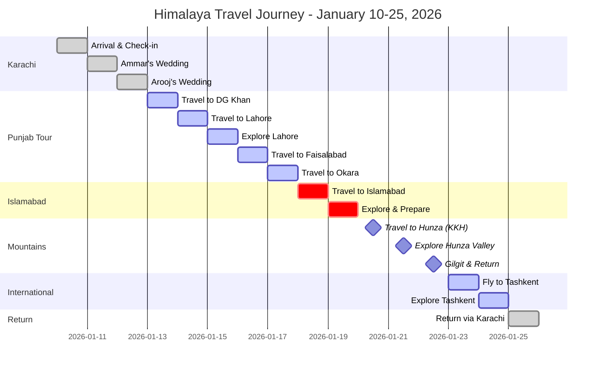

---

## Distance & Travel Time Chart

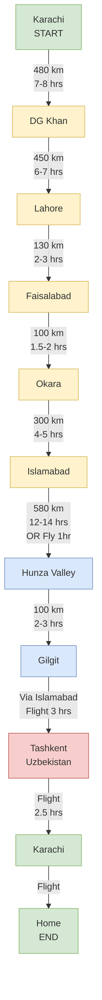

---

## Daily Activity Breakdown

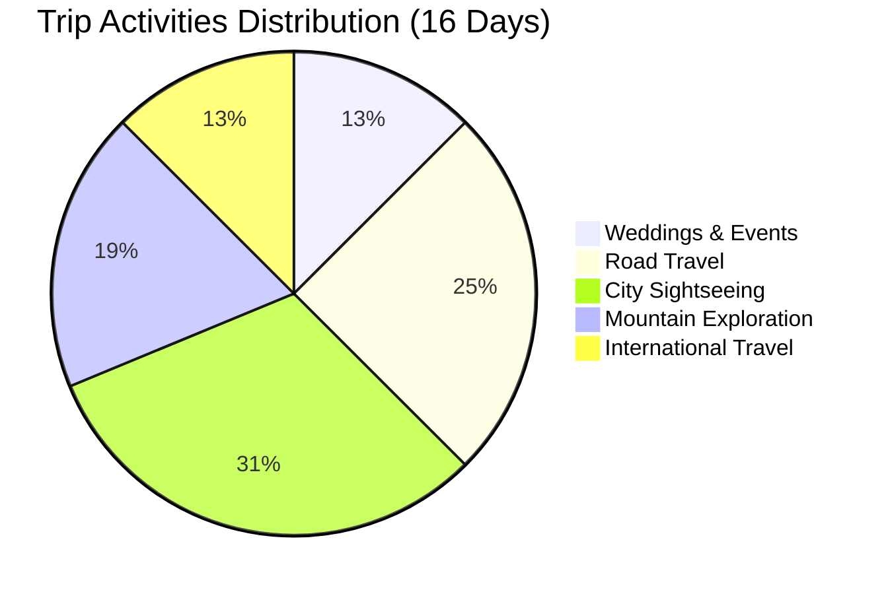

---

## Budget Distribution Chart

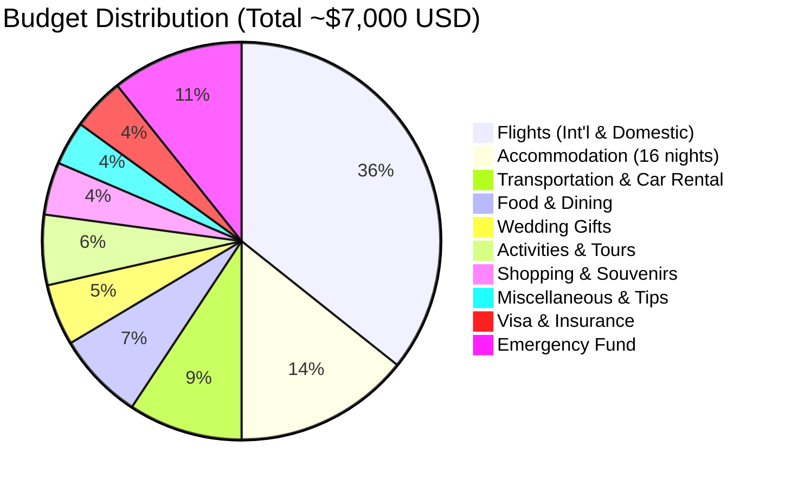

---

## Accommodation Breakdown

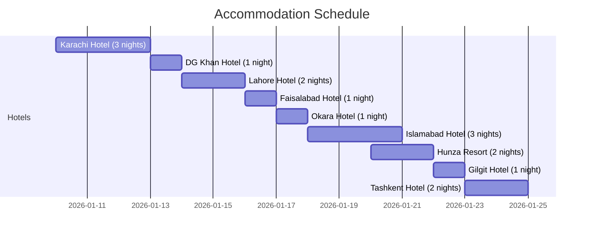

---

## Journey Flow Diagram

```mermaid
flowchart TD
    Start([Arrive Karachi<br/>Jan 10]) --> Wedding1{Ammar's Wedding<br/>Jan 11}
    Wedding1 --> Wedding2{Arooj's Wedding<br/>Jan 12}
    Wedding2 --> PunjabStart[Begin Punjab Tour<br/>Jan 13]
    PunjabStart --> DGK[DG Khan<br/>1 night]
    DGK --> LHR[Lahore<br/>2 nights<br/>Sightseeing]
    LHR --> FSD[Faisalabad<br/>Birthplace Visit]
    FSD --> OKR[Okara<br/>1 night]
    OKR --> ISB[Islamabad<br/>3 nights]
    ISB --> SpecialDinner{Special Dinner<br/>Monal Restaurant}
    SpecialDinner --> MountainPrep[Prepare for<br/>Mountains]
    MountainPrep --> KKH[Karakoram Highway<br/>Journey]
    KKH --> Hunza[Hunza Valley<br/>2 nights<br/>Forts & Lakes]
    Hunza --> Gilgit[Gilgit<br/>1 night]
    Gilgit --> ReturnISB[Return to<br/>Islamabad]
    ReturnISB --> FlyUzbekistan[Fly to Tashkent<br/>Jan 23]
    FlyUzbekistan --> Tashkent[Explore Tashkent<br/>2 days]
    Tashkent --> FlyBack[Fly to Karachi<br/>Jan 24/25]
    FlyBack --> End([Departure<br/>Jan 25])
    
    style Start fill:#d5e8d4
    style Wedding1 fill:#d5e8d4
    style Wedding2 fill:#d5e8d4
    style LHR fill:#fff2cc
    style FSD fill:#fff2cc
    style ISB fill:#fff2cc
    style SpecialDinner fill:#fff2cc
    style Hunza fill:#dae8fc
    style KKH fill:#dae8fc
    style Tashkent fill:#f8cecc
    style End fill:#d5e8d4
```

---

## Temperature Chart by Location

| Location | Average Jan Temp | Notes |
|----------|-----------------|-------|
| **Karachi** | 15-25°C (60-77°F) | Mild winter, pleasant |
| **Lahore** | 5-20°C (41-68°F) | Cool, possible fog |
| **Islamabad** | 2-15°C (36-59°F) | Cold, clear skies |
| **Hunza** | -10 to 5°C (14-41°F) | Very cold, possible snow |
| **Tashkent** | -5 to 5°C (23-41°F) | Cold, winter weather |

**Visual:**
```
Karachi      ████████████████░░░░  Mild
Lahore       ████████████░░░░░░░░  Cool
Islamabad    ██████████░░░░░░░░░░  Cold
Hunza        ████░░░░░░░░░░░░░░░░  Very Cold
Tashkent     ██████░░░░░░░░░░░░░░  Cold
             ←─────────────────→
             Warmest    Coldest
```

---

## Packing Weight Distribution

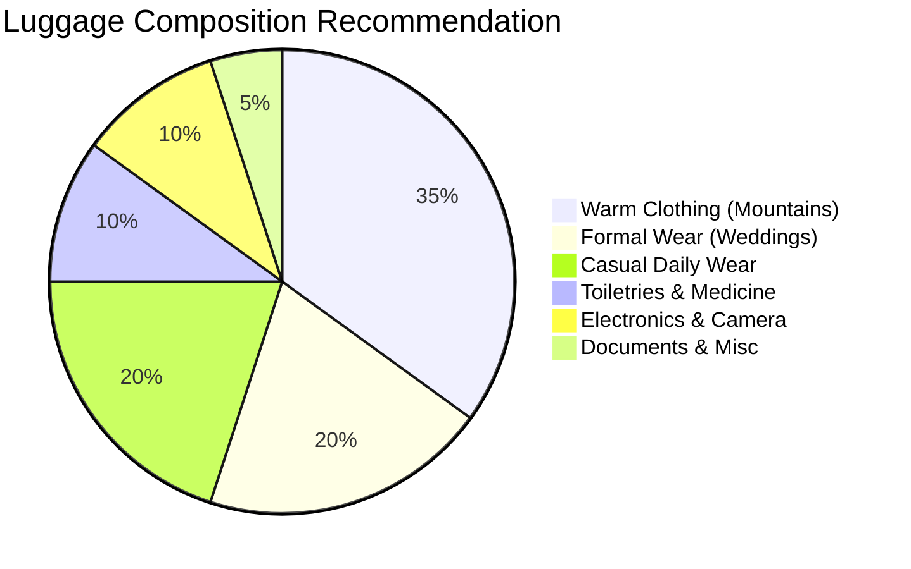

---

## Key Highlights by Region

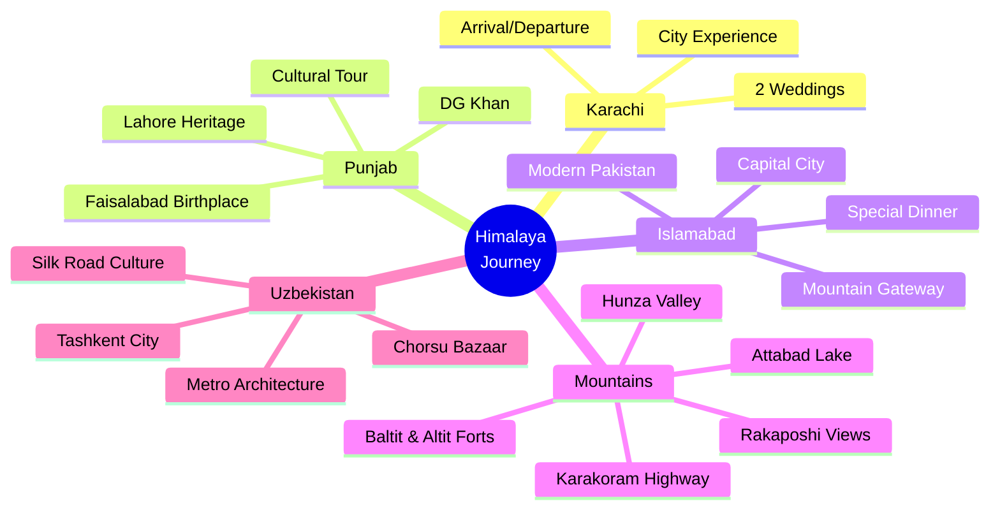

---

## Trip Statistics

### By the Numbers

| Metric | Value |
|--------|-------|
| **Total Duration** | 16 days |
| **Countries Visited** | 2 (Pakistan, Uzbekistan) |
| **Cities/Locations** | 9 major stops |
| **Weddings Attended** | 2 |
| **Road Distance** | ~2,500+ km |
| **Flights** | 4-5 (international + domestic) |
| **Hotel Nights** | 16 |
| **Mountain Days** | 3 |
| **UNESCO Sites** | 2+ (Lahore Fort, potential others) |

---

## Risk Level by Activity

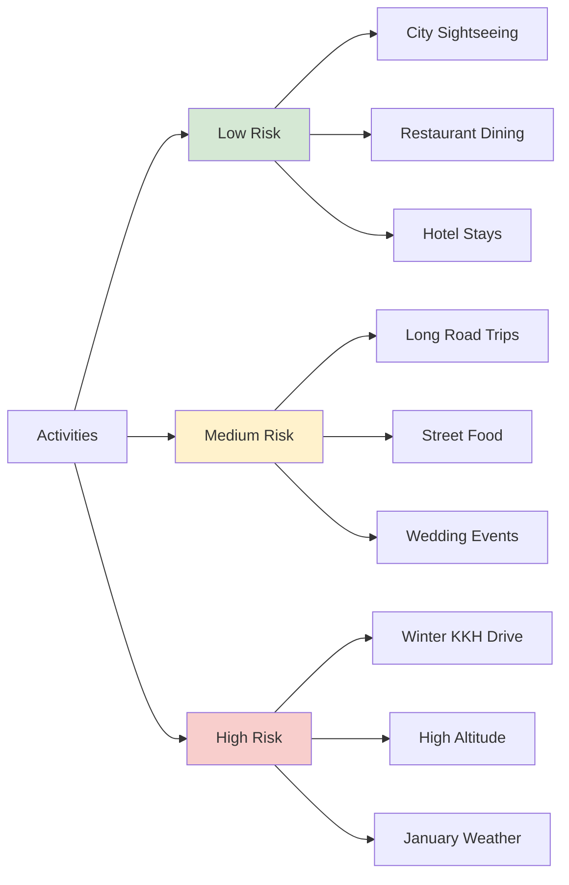

---

## Recommended Photo Opportunities

### Top 10 Photo Spots

1. **Badshahi Mosque, Lahore** - Sunset/illuminated
2. **Hunza Valley Panorama** - Eagles Nest sunrise
3. **Attabad Lake** - Turquoise water + mountains
4. **Karakoram Highway** - Multiple viewpoints
5. **Monal Restaurant** - Islamabad city lights view
6. **Baltit Fort** - Historic architecture + mountain backdrop
7. **Faisal Mosque, Islamabad** - Modern Islamic architecture
8. **Rakaposhi Mountain** - 7,788m peak from Hunza
9. **Chorsu Bazaar, Tashkent** - Market architecture
10. **Wedding Ceremonies** - Traditional Pakistani celebrations

---

## Best Times for Activities

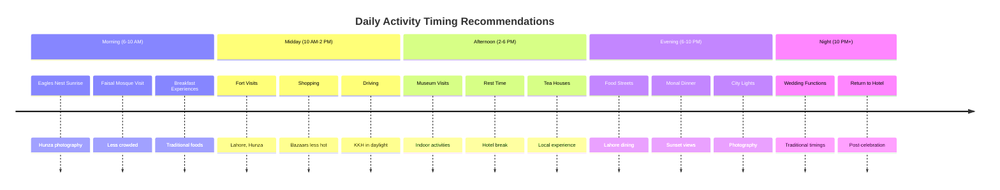

---

## Transportation Methods Used

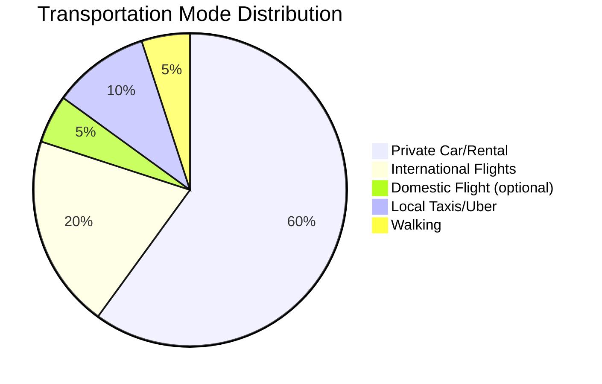

---

*These charts and visualizations provide a comprehensive overview of the journey.*
*Refer to detailed documents for specific information.*
