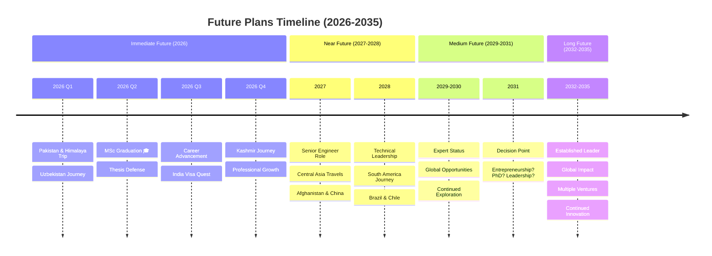

# Future Plans - Hamza Ilyas

## Vision for the Future 🚀

This document outlines the comprehensive future plans, goals, and aspirations of Hamza Ilyas across professional, academic, personal, and travel dimensions.

---

## Overview

At 25 years old, standing at the intersection of completing an MSc in Computer Engineering from Politecnico di Milano and working as an Embedded Systems Engineer at FKUnited Inc., the future holds unlimited possibilities. This document maps out realistic yet ambitious plans across multiple life dimensions.

---

## Timeline Overview

---

## Professional Future Plans

### 2026: Foundation Year

#### Q1-Q2: Academic Completion
- ✅ Complete MSc thesis research
- ✅ Defend thesis successfully
- ✅ Graduate with excellent results
- 🎯 Obtain MSc degree from Politecnico di Milano
- 🎯 Publish thesis findings (if applicable)

#### Q3-Q4: Career Transition
- 🎯 Transition to full-time professional role
- 🎯 Advance to Senior Engineer level at FKUnited Inc.
- 🎯 Take on more complex projects
- 🎯 Begin leadership responsibilities
- 🎯 Increase professional visibility

### 2027-2028: Growth & Specialization

**Technical Leadership**
- Become recognized embedded systems expert
- Lead technical teams and projects
- Mentor junior engineers
- Drive innovation initiatives

**Skill Expansion**
- Advanced certifications in embedded systems
- Specialize in emerging technologies (Edge AI, IoT Security)
- Develop leadership and management skills
- Improve presentation and communication abilities

**Professional Network**
- Attend international conferences
- Present at technical events
- Publish technical papers/articles
- Build global professional connections

### 2029-2031: Expertise & Options

**Career Paths Under Consideration**

1. **Technical Expert Track**
   - Principal/Distinguished Engineer
   - Technology Consultant
   - Industry Thought Leader

2. **Management Track**
   - Engineering Manager
   - Technical Director
   - VP of Engineering

3. **Entrepreneurship Track**
   - Start own tech company
   - Innovation lab/startup
   - Product development venture

4. **Academic Research Track**
   - Pursue PhD in Embedded Systems
   - Research + Teaching
   - Academic-Industry bridge

**Likely Scenario: Hybrid Approach**
- Continue professional excellence
- Advisory/consulting roles
- Possible entrepreneurial ventures
- Maintain academic connections

### 2032-2035: Established Leader

**Long-term Professional Vision**
- Recognized global expert in embedded systems
- Leadership position in major tech company OR
- Successful tech entrepreneur OR
- Professor + Researcher + Industry Consultant
- Multiple income streams
- Global impact and influence

---

## Academic & Research Plans

### Immediate (2026)
- ✅ Complete MSc thesis
- 🎯 Possible publication from thesis work
- 🎯 Strong academic record completion

### Short-term (2027-2028)
**Options:**
- Professional certifications
- Specialized technical courses
- Online learning and MOOCs
- Industry-specific training

**Not Immediately:**
- PhD (possible later, not immediate priority)

### Medium-term (2029-2031)
**PhD Consideration:**
- Re-evaluate PhD desire
- If yes: Apply to top programs
- Research area: Embedded Systems, RTOS, Edge Computing
- Part-time while working? Or full-time with fellowship?

**Alternative:**
- Professional doctorate (EngD)
- Executive education programs
- Continued self-learning and research

### Long-term (2032+)
**If Academic Path:**
- Complete PhD
- Publish research papers
- Attend conferences
- Teaching opportunities
- Industry-academia collaboration

**If Professional Path:**
- Remain connected to academia
- Guest lectures
- Advisory roles
- Mentoring students
- Funding research

---

## Travel & Exploration Plans

### 2026: Foundation Trips

**Q1: Pakistan & Himalaya (January)**
- ✅ Karachi: Weddings & family (Jan 10-12)
- ✅ City tour: DI Khan, Lahore, Faisalabad, Okara, Islamabad
- ✅ Himalaya trek (Main goal!)
- ✅ Uzbekistan journey
- ✅ Return Jan 25

**Q2-Q4: Special Focus**
- 🎯 India visa application (HIGH PRIORITY)
- 🎯 Kashmir planning (DREAM DESTINATION)
- 🎯 Possible UK trip (use existing visa)
- 🎯 Possible Argentina trip (use existing visa)

### 2027: Central & South Asia Expansion

**High Priority:**
- 🇮🇳 **India** - Cultural immersion, technology hubs (Bangalore, Hyderabad)
- 🏔️ **Kashmir** - Ultimate dream destination
- 🇦🇫 **Afghanistan** - Cultural and historical exploration
- 🇨🇳 **China** - Great Wall, tech cities (Shenzhen, Beijing)

**Medium Priority:**
- 🇳🇵 **Nepal** - Mountains and spirituality
- 🇰🇿 **Kazakhstan** - Silk Road cities
- Return to 🇺🇿 **Uzbekistan** - Deeper exploration

### 2028: South America Journey

- 🇦🇷 **Argentina** - Use existing visa, explore beyond cities
- 🇧🇷 **Brazil** - Rio, Amazon, Carnival experience
- 🇨🇱 **Chile** - Patagonia, Andes, Santiago
- 🇨🇴 **Colombia** - Cartagena, Bogotá, coffee region

### 2029-2031: Global Expansion

**Africa:**
- 🇪🇬 Egypt - Pyramids, Cairo
- 🇿🇦 South Africa - Cape Town, Safari
- 🇰🇪 Kenya - Wildlife, Nairobi
- 🇲🇦 Morocco - Marrakech, Sahara

**Middle East:**
- 🇦🇪 UAE - Dubai, Abu Dhabi
- 🇹🇷 Turkey - Istanbul, Cappadocia
- 🇯🇴 Jordan - Petra, Dead Sea

**More Europe:**
- 🇫🇷 France - Paris, Nice
- 🇩🇪 Germany - Berlin, Munich
- 🇪🇸 Spain - Barcelona, Madrid
- 🇨🇭 Switzerland - Alps, Zurich

**North America:**
- 🇺🇸 USA - Silicon Valley, NYC, tech conferences
- 🇨🇦 Canada - Vancouver, Toronto
- 🇲🇽 Mexico - Mexico City, Mayan ruins

### 2032-2035: World Completion

**Asia-Pacific:**
- 🇯🇵 Japan - Tokyo, Kyoto, tech culture
- 🇰🇷 South Korea - Seoul, technology
- 🇹🇭 Thailand - Bangkok, islands
- 🇸🇬 Singapore - Modern city-state
- 🇦🇺 Australia - Sydney, nature
- 🇳🇿 New Zealand - Adventure capital

**Goal by 2035:**
- Visit 50+ countries
- All inhabited continents
- Rich collection of experiences
- Global network of connections

---

## Personal Development Plans

### 2026: Foundation Building
- Complete formal education (MSc)
- Establish professional independence
- Financial stability and planning
- Health and fitness routine
- Work-life balance

### 2027-2028: Skill Diversification

**Professional Skills:**
- Advanced technical certifications
- Project management expertise
- Leadership and team building
- Business and entrepreneurship fundamentals

**Personal Skills:**
- Public speaking mastery
- Writing and blogging
- Photography and videography
- Language learning (Spanish? Chinese? Arabic?)

**Health & Wellness:**
- Regular fitness routine
- Mental health and mindfulness
- Healthy work-life integration
- Stress management

### 2029-2031: Mastery & Teaching

**Giving Back:**
- Mentor young engineers
- Write technical blog/articles
- Create educational content
- Speak at events and conferences

**Personal Growth:**
- Read extensively (50+ books/year)
- Develop creative hobbies
- Build meaningful relationships
- Community involvement

### 2032-2035: Wisdom & Impact

**Life Integration:**
- Balance multiple pursuits
- Family considerations
- Sustainable lifestyle
- Legacy building

---

## Financial Plans

### 2026-2027: Stability & Savings
- Build emergency fund (6-12 months expenses)
- Start investment portfolio
- Clear any debts
- Establish budget and tracking

### 2028-2030: Growth & Investment
- Diversified investment strategy
- Real estate consideration?
- Retirement planning start
- Multiple income streams

### 2031-2035: Wealth Building
- Passive income generation
- Strategic investments
- Business ventures
- Financial independence progress

---

## Relationship & Family Plans

### Current: Career & Education Focus
- Prioritize professional and academic goals
- Build strong foundation
- Develop as individual

### Future Considerations
- Open to meaningful relationships
- Balance career and personal life
- Family planning (when ready)
- Maintain cultural values
- Support parents and family

---

## Creative & Content Plans

### Blog/Website Development
**Phase 1 (2026):** Planning & Documentation (Current)
- Create comprehensive documentation
- Design visual diagrams
- Plan content structure

**Phase 2 (2027):** Development
- Build website/blog
- Interactive elements
- Regular content updates

**Phase 3 (2028+):** Growth
- Regular blog posts about travels
- Technical articles
- Video content
- Photography portfolio
- Growing audience

### Content Themes
- Travel experiences and visa journeys
- Embedded systems tutorials
- Career advice for international students
- Cultural observations
- Technology insights
- Life lessons and reflections

---

## Social Impact & Legacy

### Community Involvement
- Mentor students from Pakistan
- Support educational initiatives
- Technology education in developing countries
- Cultural exchange programs

### Professional Contribution
- Open source contributions
- Technical knowledge sharing
- Industry standards development
- Innovation and patents

### Cultural Bridge
- Represent Pakistan positively
- Break stereotypes
- Promote cross-cultural understanding
- Inspire next generation

---

## Decision Points & Flexibility

### Major Decision Points

**2026: Post-MSc Path**
- Stay at FKUnited vs. New opportunity
- Italy vs. Another country
- Industry vs. Academia (if PhD)

**2029: Career Direction**
- Technical expert vs. Management
- Corporation vs. Entrepreneurship
- Single focus vs. Multiple ventures

**2032: Long-term Commitment**
- Where to settle (if at all)
- Industry sector focus
- Family considerations
- Legacy planning

### Flexibility Principles
- Plans are guidelines, not constraints
- Remain open to opportunities
- Adapt to changing circumstances
- Balance planning with spontaneity
- Listen to intuition and passion

---

## Success Metrics

### Professional Success
- Senior/Lead engineer by 2028
- Recognized expert by 2031
- Leadership position by 2035
- Financial independence
- Professional satisfaction

### Personal Success
- Visit 50+ countries by 2035
- India & Kashmir achieved
- Strong global network
- Health and wellness
- Life balance and happiness

### Impact Success
- Mentored 10+ engineers
- Published technical work
- Positive influence on others
- Cultural bridge built
- Legacy established

---

## Potential Challenges & Mitigation

### Challenges
- Work-life balance during intense career growth
- Managing travel with professional commitments
- Visa challenges for Pakistani passport
- Financial constraints for extensive travel
- Staying current in rapidly evolving tech field

### Mitigation Strategies
- Careful planning and prioritization
- Build flexibility into career choices
- Start visa applications early
- Strategic financial planning
- Continuous learning commitment
- Build strong support network
- Maintain health and energy
- Regular reflection and adjustment

---

## Inspiration & Motivation

### Why These Plans?

**Professional:** 
- Passion for embedded systems and technology
- Desire to create meaningful impact
- Drive for excellence and mastery

**Travel:**
- Curiosity about the world
- Cultural understanding
- Breaking barriers
- Collecting experiences, not just visas

**Personal:**
- Growth mindset
- No regrets philosophy
- Living fully and authentically
- Balancing multiple passions

### Guiding Principles

1. **Quality over Quantity** - Do fewer things excellently
2. **Authenticity** - Be true to self and values
3. **Growth** - Never stop learning and improving
4. **Balance** - Success in multiple life dimensions
5. **Impact** - Leave the world better than found
6. **Courage** - Take calculated risks (like Jan 2026 trip!)
7. **Gratitude** - Appreciate opportunities and support

---

## Closing Thoughts

These future plans represent ambitious yet achievable goals for a 25-year-old Pakistani engineer with global aspirations. The plans are deliberately comprehensive yet flexible, providing direction while allowing for spontaneity and adaptation.

The journey from Faisalabad, Pakistan to Politecnico di Milano, Italy has already proven that with dedication, hard work, and strategic planning, seemingly impossible dreams can become reality. The next decade promises even more growth, exploration, and impact.

**The adventure continues...**

---

*"A 25-year-old Pakistani engineer with a green passport 🇵🇰 and a big dream: See the world and collect each country's visas, especially India & Kashmir!"*

*This is just the beginning.*

---

*Last Updated: December 17, 2025*  
*This is a living document, updated as life unfolds and plans evolve.*  
*Version: 1.0*

---

## License

Content © 2025 by Hamza Ilyas  
Licensed under Creative Commons Attribution-NonCommercial-NoDerivatives 4.0 International (CC BY-NC-ND 4.0)

FKUnited Inc. © 2025 by Hamza Ilyas
